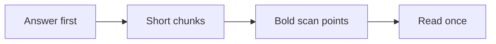

# How to Read

**Every AI response becomes easier to read.**

How to Read is an always-on accessibility skill for:

- Claude Code
- Codex
- Cursor
- GitHub Copilot

It answers first.
It uses short sentences, bold scan points, diagrams, and small code chunks.



## Install once

**macOS, Linux, WSL, or Git Bash**

```bash
curl -fsSL https://raw.githubusercontent.com/MorrisHannessen/how-to-read/main/install.sh | bash
```

**Windows PowerShell**

```powershell
irm https://raw.githubusercontent.com/MorrisHannessen/how-to-read/main/install.ps1 | iex
```

The installer adds the skill and an always-on rule for all 4 platforms.
It preserves existing instruction files inside marker fences.

## Choose the detail

| You say | You get |
|---|---|
| Nothing | Short answer in 3-5 lines |
| `more` | Reasons, steps, and an example |
| `full` | Complete detail and edge cases |

## What changes

- **Answer first.** Context follows.
- **1 idea per sentence.** Most sentences stay under 15 words.
- **Stable terms.** One name stays attached to one concept.
- **Visual logic.** Flows become diagrams.
- **Small code blocks.** Each block explains one idea.

Technical terms stay exact.
The skill glosses an unfamiliar term once.

## Platform support

| Platform | Skill | Always-on layer |
|---|---:|---|
| Claude Code | `~/.claude/skills/how-to-read` | `~/.claude/CLAUDE.md` |
| Codex | `~/.agents/skills/how-to-read` | `~/.codex/AGENTS.md` |
| Cursor | Plugin skill | Plugin `alwaysApply` rule |
| GitHub Copilot | `~/.copilot/skills/how-to-read` | Personal instructions |

Native plugin manifests also live in [`plugins/how-to-read`](plugins/how-to-read).

See [INSTALL.md](INSTALL.md) for one-platform, repository, dry-run, and uninstall commands.
See [docs/RESEARCH.md](docs/RESEARCH.md) for the accessibility rationale and limits.

## Privacy

The skill makes **0 network calls** after installation.
It collects no data and has no account.

## License

MIT
