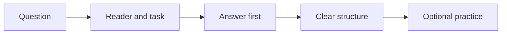

# How to Read

**AI responses designed to be easier to understand.**

How to Read is an always-on response-formatting skill for:

- Claude Code
- Codex
- Cursor
- GitHub Copilot

It answers first, adapts detail to the reader, makes relationships explicit,
and uses emphasis or visuals only when they help.



In text: the skill identifies the reader and task, gives the answer, structures
the explanation, and adds practice only when the user asks to learn.

## Install once

**macOS, Linux, WSL, or Git Bash**

```bash
curl -fsSL https://raw.githubusercontent.com/MorrisHannessen/how-to-read/main/install.sh | bash
```

**Windows PowerShell**

```powershell
irm https://raw.githubusercontent.com/MorrisHannessen/how-to-read/main/install.ps1 | iex
```

The installer adds the skill and an always-on rule for all 4 platforms.
It preserves existing instruction files inside marker fences.

## Choose the response

| You say | You get |
|---|---|
| Nothing | The smallest complete answer |
| `more` | Reasons, key steps, and an example when useful |
| `full` | A complete explanation, evidence, assumptions, and edge cases |
| `beginner` | Defined terms, explicit decisions, and a worked example |
| `experienced` | Decisions, differences, risks, and exceptions without basic background |
| `less bold`, `no diagrams`, or `one step at a time` | That presentation preference until you change it |

## What changes

- **Answer first.** Context follows the result.
- **Adaptive detail.** Guidance changes with the reader's likely knowledge.
- **Explicit relationships.** Causes, contrasts, conditions, and order are named.
- **Selective emphasis.** Bold text marks genuine scan points without a quota.
- **Meaningful numbers.** Exact values gain a concrete comparison when useful.
- **Accessible visuals.** Every diagram also has a text explanation.
- **Focused code.** Examples stay understandable without breaking copyable units.
- **Optional learning.** Worked examples and recall prompts appear only for learning requests.

Technical terms, commands, paths, URLs, quotations, logs, and errors stay exact.
Accuracy and safety override brevity.

## Why these choices

- The [W3C cognitive-accessibility guidance](https://www.w3.org/WAI/WCAG2/supplemental/objectives/o3-clear-content/)
  recommends clear words, short blocks, unambiguous content, summaries, and
  supportive visuals. Its [readability technique](https://www.w3.org/WAI/WCAG22/Techniques/general/G153)
  also recommends explicit logical relationships, clear references, and
  consistent labels.
- A [meta-analysis of highlighting research](https://eric.ed.gov/?id=EJ1334669)
  found that instructor-provided highlighting improved memory and comprehension
  in educational texts. How to Read therefore emphasizes selected ideas rather
  than forcing a fixed amount of bold text.
- A [2025 meta-analysis of adaptive instruction](https://doi.org/10.1016/j.learninstruc.2025.102142)
  found that lower-knowledge learners benefited from more assistance, while
  higher-knowledge learners benefited from less. The skill adjusts scaffolding
  instead of treating every reader as a beginner.
- Meta-analyses support [signaling relationships between text and pictures](https://doi.org/10.1016/j.edurev.2015.12.003)
  and [segmenting instructional material](https://doi.org/10.1007/s10648-018-9456-4).
  The skill uses diagrams and chunks only when they clarify structure.
- A controlled study found that
  [retrieval practice can improve meaningful learning](https://pubmed.ncbi.nlm.nih.gov/21252317/).
  The skill uses a recall or application prompt only when the user asks to learn
  or practice.

See the [research notes](docs/RESEARCH.md) for the evidence-to-rule mapping,
source types, and limitations.

## Limits

How to Read is a response-formatting preference, not medical treatment or a
diagnostic tool. Reader preferences differ, and research from educational
materials does not prove that every AI response will become easier to
understand.

The skill does not use Bionic Reading. A
[2024 controlled study](https://doi.org/10.1016/j.actpsy.2024.104304) found no
reading-speed benefit from bolding part of every word. It also does not require
a special dyslexia font because controlled studies of
[Dyslexie](https://doi.org/10.1007/s11881-017-0154-6) and
[OpenDyslexic](https://pmc.ncbi.nlm.nih.gov/articles/PMC5629233/) did not show a
general reading-performance advantage.

## Platform support

| Platform | Skill | Always-on layer |
|---|---:|---|
| Claude Code | `~/.claude/skills/how-to-read` | `~/.claude/CLAUDE.md` |
| Codex | `~/.agents/skills/how-to-read` | `~/.codex/AGENTS.md` |
| Cursor | Plugin skill | Plugin `alwaysApply` rule |
| GitHub Copilot | `~/.copilot/skills/how-to-read` | Personal instructions |

Native plugin manifests also live in [`plugins/how-to-read`](plugins/how-to-read).

See [INSTALL.md](INSTALL.md) for one-platform, repository, dry-run, and uninstall
commands.

## Privacy

The skill makes **0 network calls** after installation.
It collects no data and has no account.

## License

MIT
